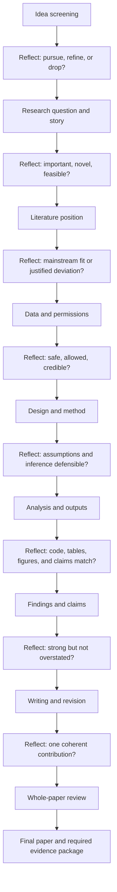

# PaperPilot

> **Human-guided AI workflow for building one serious economics or finance paper with Codex or Claude Code.**

PaperPilot helps a researcher move from **first idea** to **final paper and evidence package** while keeping the human responsible for the decisions that matter: question, novelty, data permissions, identification, interpretation, claim strength, and final sign-off.

The goal is simple:

> **Maximize research quality per unit of human input.**

---

## What PaperPilot can help you do

| Research need | What PaperPilot does | What you still decide |
| --- | --- | --- |
| Screen ideas | scores idea potential, identifies weak ideas to stop early, flags high-upside ideas to chase | whether the idea is worth your scarce time |
| Form the question | turns a broad idea into question/story options with pros, cons, risks, and evidence needed | which path fits your taste and judgment |
| Position in literature | builds a literature map and explains where the paper fits or deviates | whether the contribution is credible enough |
| Handle data safely | classifies public, licensed, restricted, confidential, and private materials before use | what data the agent may inspect |
| Design methods | compares empirical/theory/design options and required assumptions | which design is defensible |
| Produce analysis outputs | plans code, tables, figures, robustness, and reproducibility checks | whether estimates support the claims |
| Interpret findings | links results to mechanism, magnitude, limitations, and literature | how strong the paper’s claims should be |
| Draft and revise | writes sections, checks coherence, revises the full paper repeatedly | final voice, claims, and responsibility |
| Prepare evidence | records AI conversations, human decisions, time, data access, model config, and contribution records | what is disclosed and submitted |
| Coordinate agent roles | keeps a task board, blocker log, status log, and reusable lessons for multi-agent collaboration | which tasks need human judgment or approval |

---

## The workflow at a glance

The paper does not move forward in a straight line. Each stage has reflection gates.



At every stage:

```text
AI proposes
↓
AI self-critiques
↓
AI gives options, pros/cons, risks, evidence needed
↓
Human chooses
↓
AI executes only the approved path
↓
AI runs three checks
↓
Records and memory are updated
```


---

## Optional: coordinate multiple agent roles

Most users can run PaperPilot with one Codex or Claude Code session. If you want the agent to behave like a small research team, open:

```text
05_Coordinate_Multiple_Agents/
```

This folder gives you a task board, blocker log, status log, reusable lessons log, and role definitions. The user still controls the work; the agent must report whether each task is planned, active, blocked, needs human input, or done.

```text
Task board → role assignment → Plan Mode → decision packet → approved Action Mode → status update → evidence update
```

---

## What inputs do researchers need to provide?

You do **not** need to prepare everything at the start. Give only the information needed for the current stage.

| Stage | Minimum input from you | Agent output | Records updated |
| --- | --- | --- | --- |
| 1. Idea screening | rough idea, field, target audience if known | idea score, potential ceiling, stop/refine/chase recommendation | memory, idea score, decision packet |
| 2. Question and story | preferred question or idea direction | 2-4 question/story paths with pros/cons | memory, human decision |
| 3. Literature | seed papers, keywords, field, or “unknown” | source-grounded literature map and gap options | conversations, claim/evidence notes |
| 4. Novelty | what feels different from mainstream | novelty/deviation packet and referee objections | novelty register |
| 5. Data | dataset names, access status, safe materials only | data safety classification and onboarding plan | data access records |
| 6. Design/method | candidate method or empirical setting | method options, assumptions, diagnostics, failure modes | decision packet, stage quality record |
| 7. Analysis | software preference, variables, desired outputs | code/table/figure plan and reproducibility checks | contribution and claim records |
| 8. Findings | results, tables, figures, or summaries | interpretation, limitations, claim strength | claim registry, risk register |
| 9. Writing | outline, notes, or approved facts | paper draft, revision plan, consistency checks | conversations, decisions |
| 10. Final review | full draft and records | whole-paper review, 10-perspective quality score, final stop/revise decision | final readiness package |

If a stable fact is already recorded, the agent should **not ask again**. It must check memory first.

---

## What does “say it once” mean?

PaperPilot stores stable facts in project memory and context files. The agent must check these before asking you questions:

```text
03_Record_Required_Evidence/PROJECT_MEMORY.yml
02_Build_The_Paper/PAPER_CONTEXT.md
03_Record_Required_Evidence/02_Human_Decisions/
03_Record_Required_Evidence/04_Record_Data_Access_And_Permissions/
03_Record_Required_Evidence/00_Project_Dashboard/
```

If you already told the agent the data source, software preference, target journal, novelty angle, or risk tolerance, it should reuse that fact. If the fact changes, the agent updates memory and logs the change.

---

## Two ways to use it

| Use case | How to use |
| --- | --- |
| Use directly | clone/download, open `01_Start_Here/`, choose Codex or Claude Code, paste the first prompt |
| Tailor before using | clone/download, edit the start prompts, stage skills, data rules, and scoring thresholds for your paper or lab |

You do **not** need to read the internal skill files to start. They are there so Codex or Claude Code can route tasks correctly. Advanced users can tailor them later.

---

## Choose your agent

| Agent | Open | Best for |
| --- | --- | --- |
| Codex | `01_Start_Here/Use_Codex.md` | cloud/GitHub-style agent work and pull-request-like workflows |
| Claude Code | `01_Start_Here/Use_Claude_Code.md` | local terminal workflow where you can watch and steer file edits |

Both modes use the same behavior contract:

```text
Plan Mode first.
Check memory before asking.
Ask only missing questions.
Use decision packets.
Wait for human approval before edits.
Run three checks at each stage.
Update required evidence in parallel.
```

---

## Three checks at each stage

A stage is not complete after one nice answer. It must pass three rounds:

```text
Round 1: consistency and missing-input check
Round 2: evidence, data, method, and feasibility check
Round 3: reviewer-risk and next-stage readiness check
```

Remaining issues must be classified as:

```text
fixed
accepted limitation
human-approved tradeoff
future work
blocked with documented reason
```

---

## Final-paper quality score

PaperPilot includes a 10-perspective top-journal-style quality score. It is **not** an official Journal of Finance score or acceptance prediction. It is a disciplined internal benchmark.

| Dimension | What it asks |
| --- | --- |
| Big question | Is the question important enough? |
| Novelty | Is the contribution original and defensible? |
| Literature | Is the positioning accurate? |
| Mechanism | Is the economic logic clear? |
| Data | Are data construction and permissions credible? |
| Design | Is identification or modeling defensible? |
| Execution | Are code, tables, figures, and robustness reproducible? |
| Results | Are magnitudes and evidence strong enough? |
| Claims | Are limitations and referee risks handled? |
| Writing | Does the paper read as one coherent contribution? |

Decision rules:

```text
Idea potential <= 70: normally stop, pivot, or merge into another project.
Idea potential 85-94: promising but needs refinement.
Idea potential 95-100: chase if feasible.
Final paper >= 95 and no hard-stop issue: revision may stop.
```

---

## Required evidence grows in parallel

PaperPilot is designed for AFA-style documentation. It helps record evidence while the paper develops, not after the fact.

| Evidence | Where it is recorded |
| --- | --- |
| AI conversations and prompts | `03_Record_Required_Evidence/01_AI_Conversations/` |
| Human decisions | `03_Record_Required_Evidence/02_Human_Decisions/` |
| Human time and contribution | `03_Record_Required_Evidence/03_Record_Human_Time_And_Contributions/` |
| Data access and permissions | `03_Record_Required_Evidence/04_Record_Data_Access_And_Permissions/` |
| Claims, evidence, and risks | `03_Record_Required_Evidence/05_Record_Claims_Evidence_And_Risks/` |
| Stage and whole-paper checks | `03_Record_Required_Evidence/07_Full_Paper_Quality_Cycles/` and `08_Stage_Quality_Cycles/` |
| Parallel documentation tracker | `03_Record_Required_Evidence/09_Parallel_AFA_Documentation/` |
| Novelty/deviation records | `03_Record_Required_Evidence/10_Novelty_And_Mainstream_Deviations/` |
| Journal-quality score | `03_Record_Required_Evidence/11_Journal_Quality_Score/` |
| Final package | `03_Record_Required_Evidence/06_Submission_Package/` |

---

## Data safety

Do not upload or expose licensed, restricted, confidential, proprietary, identifiable, referee, or private coauthor material unless explicit permission exists.

Use metadata, codebooks, toy rows, synthetic data, or approved secure environments first. Start with:

```text
01_Start_Here/Data_Safety_First.md
02_Build_The_Paper/02_Data_And_Code/
```

---

## How to test whether the agents are behaving correctly

Open:

```text
04_Check_And_Finalize_Paper/Agent_Behavior_Test.md
```

Use it to test whether Codex or Claude Code:

- starts in Plan Mode;
- reads memory before asking;
- asks only missing questions;
- creates decision packets;
- waits before editing;
- updates required evidence;
- respects data safety;
- runs three-round checks;
- preserves justified novelty;
- uses the quality score correctly.

---

## First step

Open:

```text
01_Start_Here/README.md
```

If you want multiple agent roles, also open:

```text
05_Coordinate_Multiple_Agents/README.md
```

Then choose:

```text
Use_Codex.md
Use_Claude_Code.md
Run_Full_Paper_Process.md
```
